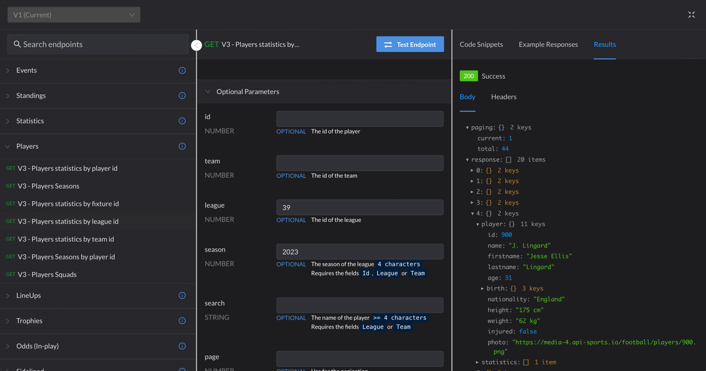

# VIC207-api

Group Members: William Clayton, Nursultan Nurapin, Shayan Dsouza

Project Domain: Football team draft simulator / tournament simulator (if we have time)

Our team is hoping to create a simple football draft simulator using data from the API-Football API.
The idea is that the user will be given the chance to create their own football team of players from all around the
world.
The application will prompt the user with a choice of 5 (or so) randomly selected players for each position on the
field, allowing the user to select which player they want on their team. Once all the players are selected, stats for 
the team as well as players will be available to the user to access. They will be able to substitute players
and make decisions based on real world data. If we have time, we also want to implement a way for the player
to test their team against another randomly generated team in either a tournament style or head to head. The player may
also pit their team against real life teams, and we could also have a feature that shows their team's ranking
among others in a certain league or across the world. The winner of a game will be based on calculations performed on
the overall statistics of the team, which is based on stats of each
player. If we still have time, we also wish to include a generative commentary feature using a GPT API or something
similar. 

API-Football Documentation :https://www.api-football.com/documentation-v3

Example of trying the API using RapidAPI:

Technical problems so far: